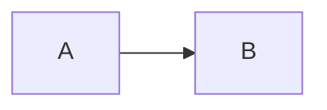

## Markdown语法

==（1）标题==

# 一级标题

## 二级标题

### 三级标题

#### 四级标题

##### 五级标题

###### 六级标题

==（2）字体==

**加粗**

*斜体*

***斜体加粗***

~~删除线~~

==高亮==

我是<sup>上标</sup>

我是<sub>下标</sub>

==（3）列表==

-  一二三四五

1. 一二三四五
2. 上山打老虎

==（4）引用==

>一二三四五

> Dorothy followed her through many of the beautiful rooms in her castle.
>
> > The Witch bade her clean the pots and kettles and sweep the floor and keep the fire fed with wood.

==（5）分割线==

-----

==（6）代码==

`我是代码`

```

我是代码框

```

时代[^1]

**时代**     Ctrl+B:加粗
*时代*     Ctrl+I:斜体

[^1]: 年代结构

~~~flow
```flow
st=>start: 第一步
op=>operation: 第二步
cond=>condition: Yes or No?
e=>end

st->op->cond
cond(yes)->e
cond(no)->op
```
~~~



```flow
​```flow
start=>start: API请求
cache=>operation: 读取Redis缓存
cached=>condition: 是否有缓存？
sendMq=>operation: 发送MQ，后台服务更新缓存
info=>operation: 读取信息
setCache=>operation: 保存缓存
end=>end: 返回信息

start->cache->cached
cached(yes)->sendMq
cached(no)->info
info->setCache
setCache->end
sendMq->end
```

```flow
​```flow
start=>start: 接收到消息
info=>operation: 读取信息
setCache=>operation: 更新缓存
end=>end: 处理结束

start->info->setCache->end
```

